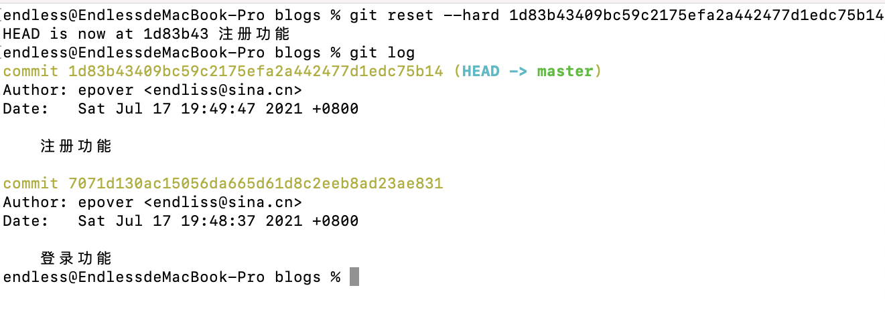

#  如何使用Git和GitHub


#### 1、什么是Git？

​	Git 是一个免费的开源 分布式版本控制系统，旨在快速高效地处理从小到大的所有项目。

#### 2、安装git

```
brew install git
git -version
```

#### 3、git常用命令

```
git init		
git add .
git add 文件名
git commit -m 文件名
git status
git reset --hard 版本号
git reset HEAD 文件名
git checkout -- 文件名
```

#### 4、blogs项目使用git案例

1.首先写一个简单功能的html

```html
<!DOCTYPE html>
<html>
<head>
	<meta charset="utf-8">
	<title>index</title>
</head>
<body>	
		<h1>登录</h1>
</body>
</html>
```

在blogs文件下初始化项目添加到暂存区和提交

第一次提交登录功能

```
git init
git status
git add index.html
git commit -m '登录功能'
```


第二次提交注册功能

```html
<!DOCTYPE html>
<html>
<head>
	<meta charset="utf-8">
	<title>index</title>
</head>
<body>	
		<h1>登录</h1>
  <h1>注册</h1>
</body>
</html>
```

```
git init
git status
git add index.html
git commit -m '注册功能'
```

第三次提交直播功能

```html
<!DOCTYPE html>
<html>
<head>
	<meta charset="utf-8">
	<title>index</title>
</head>
<body>	
			<h1>登录</h1>
 		 <h1>注册</h1>
 		 <h1>直播</h1>
</body>
</html>
```

```
git init
git status
git add index.html
git commit -m '直播功能'
git log 查看版本
```


现在我们想要删除直播功能，回到注册功能代码

```
git reflog
git reset --hard 1d83b43409bc59c2175efa2a442477d1edc75b14
```



此时html代码为

```html
<!DOCTYPE html>
<html>
<head>
	<meta charset="utf-8">
	<title>index</title>
</head>
<body>	
		<h1>登录</h1>
  <h1>注册</h1>
</body>
</html>
```

现在我们想恢复直播功能

```
endless@EndlessdeMacBook-Pro blogs % git reset --hard 7315226
HEAD is now at 7315226 直播
```


此时html代码：

```html
<!DOCTYPE html>
<html>
<head>
	<meta charset="utf-8">
	<title>index</title>
</head>
<body>	
			<h1>登录</h1>
 		 <h1>注册</h1>
 		 <h1>直播</h1>
</body>
</html>
```


当文件代码添加到暂存区，怎么返回

```
endless@EndlessdeMacBook-Pro blogs % git reset HEAD index.html 
Unstaged changes after reset:
M	index.html
```

当代码更新，可以使用checkout来恢复到最初

```
endless@EndlessdeMacBook-Pro blogs % git checkout -- index.html 
```


