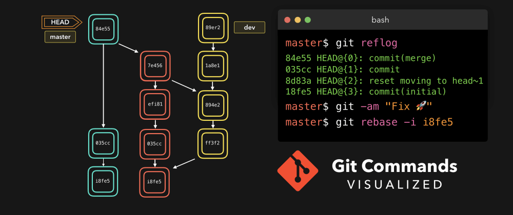
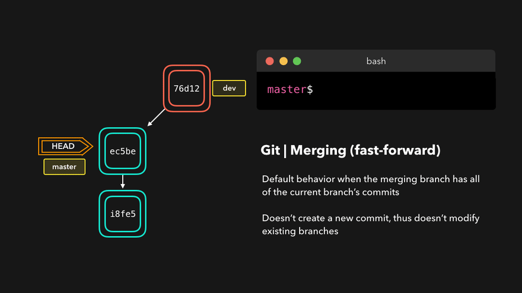
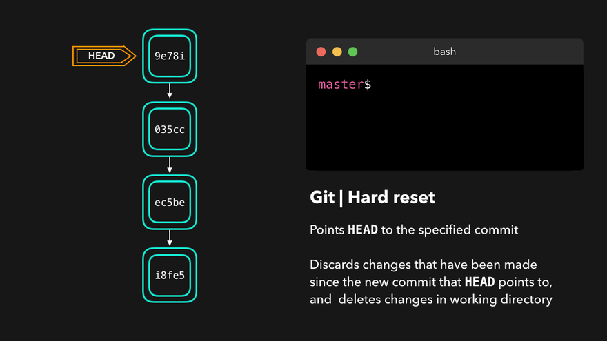
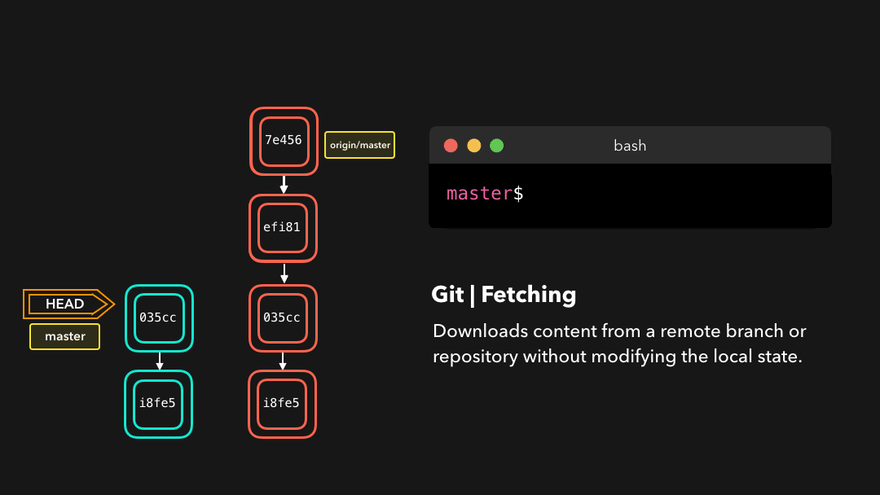

原文地址：https://dev.to/lydiahallie/javascript-visualized-event-loop-3dif

作者：Lydia Hallie

# 🌳🚀 CS 可视化：有用的 Git 命令 

## 合并

拥有多个分支非常方便，可以将新更改彼此分开，并确保您不会意外地将未经批准或损坏的更改推送到生产中。一旦更改获得批准，我们希望在我们的生产分支中获得这些更改！

将更改从一个分支转移到另一个分支的一种方法是执行`git merge`! Git 可以执行两种类型的合并：**fast-forward**或**no-fast-forward** 🐢

这现在可能没有多大意义，所以让我们看看差异！

### 快进 ( `--ff`)

一个**快进合并**相比，我们正在合并分支当前分支已经没有多余的提交可能发生。Git 是...*懒惰*，将首先尝试执行最简单的选项：快进！这种类型的合并不会创建新的提交，而是将我们正在合并的分支上的提交合并到当前分支🥳

完美的！我们现在拥有在`dev`分支上可用的`master`分支上所做的所有更改。那么，什么是**禁止快进**呢？

------

### 禁止快进 ( `--no-ff`)

如果您当前的分支与您要合并的分支相比没有任何额外的提交，那就太好了，但不幸的是，这种情况很少发生！如果我们在要合并的分支没有的当前分支上提交了更改，git 将执行*非快进*合并。

通过非快进合并，Git在活动分支上创建一个新的*合并提交*。提交的父提交同时指向活动分支和我们要合并的分支！

没什么大不了的，完美融合！🎉`master`分支现在包含我们在`dev`分支上所做的所有更改。

------

### 合并冲突

尽管 Git 擅长决定如何合并分支和向文件添加更改，但它不能总是自己做出这个决定🙂 当我们尝试合并的两个分支在同一文件的同一行上有更改时，就会发生这种情况，或者如果一个分支删除了另一个分支修改的文件，等等。

在这种情况下，Git 会要求您帮助决定我们要保留两个选项中的哪一个！假设在两个分支上，我们都编辑了`README.md`.

如果我们想合并`dev`到`master`，这将导致合并冲突：您希望标题是`Hello!`还是`Hey!`？

当尝试合并分支时，Git 会显示冲突发生的位置。我们可以手动删除不想保留的更改，保存更改，再次添加更改的文件，然后提交更改🥳

耶！尽管合并冲突通常很烦人，但它完全有道理：Git 不应该只是*假设*我们想要保留哪些更改。

------

## 变基 rebase

我们刚刚看到了如何通过执行`git merge`. 将更改从一个分支添加到另一个分支的另一种方法是执行`git rebase`.

一个`git rebase` *副本*从当前分支的提交，并提出这些复制提交指定的分支上。

完美，我们现在拥有在`master`分支上可用的所有更改`dev`！🎊

与合并相比，一个很大的区别是 Git 不会试图找出要保留和不保留的文件。我们正在变基的分支始终具有我们想要保留的最新更改！您不会以这种方式遇到任何合并冲突，并保持良好的线性 Git 历史记录。

此示例显示了基于`master`分支的变基。但是，在较大的项目中，您通常不想这样做。当为复制的提交创建新的哈希时`git rebase` **，** A 会**更改项目的历史记录**！

每当您在功能分支上工作并且主分支已更新时，变基都很棒。您可以获得分支上的所有更新，这将防止未来的合并冲突！😄

### 交互式变基

在重新提交提交之前，我们可以修改它们！😃 我们可以通过*交互式 rebase 来实现*。交互式 rebase 在您当前正在处理的分支上也很有用，并且想要修改一些提交。

我们可以对正在变基的提交执行 6 个操作：

- `reword`: 更改提交信息
- `edit`: 修改这个提交
- `squash`: 将提交合并到之前的提交中
- `fixup`: 将提交合并到上一个提交中，而不保留提交的日志消息
- `exec`：在我们想要变基的每个提交上运行一个命令
- `drop`: 删除提交

惊人的！这样，我们就可以完全控制我们的提交。如果我们想删除一个提交，我们就可以`drop`了。

或者，如果我们想将多个提交压缩在一起以获得更清晰的历史记录，没问题！

交互式变基使您可以对尝试变基的提交进行大量控制，即使在当前活动分支上！

------

## 回滚

我们可能会提交我们以后不想要的更改。也许这是一次`WIP`提交，或者可能是一次引入了错误的提交！🐛 在这种情况下，我们可以执行一个`git reset`.

A`git reset`摆脱了所有当前的暂存文件，并让我们控制`HEAD`应该指向的位置。

### 软回滚

一个*软回滚*移动`HEAD`到指定的提交（或相对于提交的指数`HEAD`），没有摆脱被引入于事后提交的变化！

假设我们不想保留`9e78i`添加`style.css`文件的提交，也不想保留`035cc`添加`index.js`文件的提交。但是，我们要保持最新添加`style.css`和`index.js`档案！软回滚的完美用例。

键入 时`git status`，您会看到我们仍然可以访问在先前提交中所做的所有更改。这很棒，因为这意味着我们可以修复这些文件的内容并在以后再次提交它们！

------

### 硬回滚

有时，我们不想保留某些提交引入的更改。与软回滚不同，我们不再需要访问它们。Git 应该简单地将其状态回滚回指定提交时的状态：这甚至包括工作目录和暂存文件中的更改！💣

Git 已经放弃了在`9e78i`和上引入的更改`035cc`，并将其状态回滚为提交时的状态`ec5be`。

------

### revert

还原更改的另一种方法是执行`git revert`. 通过还原某个提交，我们创建了一个包含还原更改的*新提交*！

假设`ec5be`添加了一个`index.js`文件。后来，我们实际上意识到我们不希望此提交引入此更改了！让我们恢复`ec5be`提交。

完美的！Commit`9e78i`恢复了由`ec5be`提交引入的更改。执行 a`git revert`对于撤消某个提交非常有用，而无需修改分支的历史记录。

------

## cherry-pick

当某个分支包含在活动分支上引入了我们需要的更改的提交时，我们可以使用`cherry-pick`该命令！通过`cherry-pick`提交提交，我们在活动分支上创建了一个新提交，其中包含由`cherry-pick`ed 提交引入的更改。

假设分支`76d12`上的提交`dev`向`index.js`我们想要在`master`分支中的文件添加了更改。我们不希望*整个*我们只关心这一次提交！

很酷，主分支现在包含`76d12`引入的更改！

------

## fetch

如果我们有一个远程 Git 分支，例如 Github 上的一个分支，那么远程分支可能有当前分支没有的提交！也许另一个分支被合并了，你的同事推动了一个快速修复，等等。

我们可以通过`git fetch`在远程分支上执行 a在本地获取这些更改！它不会以任何方式影响您的本地分支：a`fetch`只是下载新数据。

我们现在可以看到自上次推送以来所做的所有更改！既然我们在本地拥有新数据，我们就可以决定要对它做什么。

------

## pull

虽然 a`git fetch`对于获取分支的远程信息非常有用，但我们也可以执行 a `git pull`。A`git pull`实际上是两个命令合二为一： a`git fetch`和 a `git merge`。当我们从原点拉取更改时，我们首先像使用 a 一样获取所有数据`git fetch`，之后最新的更改会自动合并到本地分支中。

太棒了，我们现在与远程分支完全同步并拥有所有最新更改！🤩

------

## reflog

每个人都会犯错，这完全没问题！有时可能会觉得你把你的 git 仓库搞得一团糟，以至于你只想完全删除它。

`git reflog`是一个非常有用的命令，用于显示已采取的所有操作的日志！这包括合并、回滚、还原：基本上是对分支的任何更改。

如果您犯了错误，您可以通过`HEAD`根据`reflog`提供给我们的信息进行回滚来轻松重做！

假设我们实际上不想合并源分支。当我们执行`git reflog`命令时，我们看到合并前 repo 的状态是`HEAD@{1}`。让我们执行 a`git reset`将 HEAD 指向它所在的位置`HEAD@{1}`！

可以看到，最新的动作已经推送到了`reflog`！
